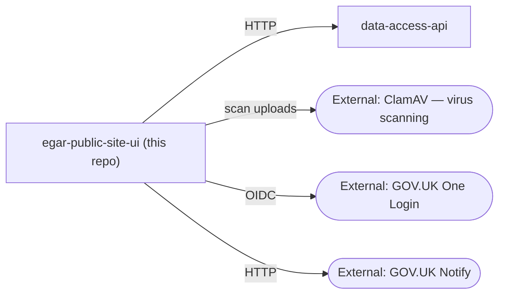

# egar-public-site-ui

## What this is

The sGAR front end: a Node/Express application in plain JavaScript that renders server-side Nunjucks templates using the GOV.UK Design System. It is the older front end for General Aviation Reports and has more legacy variation than `ssar-public-site-ui`.

## System context and boundaries

```mermaid
flowchart LR
    UI["egar-public-site-ui (this repo)"]
    API["data-access-api"]
    CLAMAV(["External: ClamAV — virus scanning"])
    ONELOGIN(["External: GOV.UK One Login"])
    NOTIFY(["External: GOV.UK Notify"])

    UI -- HTTP --> API
    UI -- "scan uploads" --> CLAMAV
    UI -- OIDC --> ONELOGIN
    UI -- HTTP --> NOTIFY
```

This repository owns the sGAR web journey, authentication flows, upload scanning, and its own account/registration/invite notifications. `data-access-api` owns GAR, passenger, and organisation state and routes submitted GARs to the queue consumers; this UI does not call CBP, AMG, or either queue directly.

If a change adds, removes, or redirects an external call, update the diagram and the relevant contract information in this file.

## External dependencies

| Dependency | Direction | Purpose | Configuration |
|---|---|---|---|
| `data-access-api` | HTTP | GAR, passenger, and organisation data | `common/config/index.js` |
| GOV.UK One Login | OIDC/HTTP | Login, registration, logout, and organisation invites | `ONE_LOGIN_*` |
| ClamAV | HTTP | Scan supporting-document uploads | `CLAMAV_BASE`, `CLAMAV_PORT` |
| GOV.UK Notify | HTTP | Account, registration, and invite messages | `NOTIFY_*` |

## Data/API contracts

The UI calls `data-access-api` for all report and user state. Supporting documents are scanned here before being sent to that API. Authentication is not only the OIDC handshake: login guards also depend on organisation and user data returned by `data-access-api`.

Supporting-document limits are enforced here, but the downstream CBP submission also includes generated XLSX/PDF files and base64 encoding. See the corresponding `data-integr-cbp/AGENTS.md` warning before changing upload limits.

## Development setup

Follow [`docs/setup.md`](docs/setup.md) when preparing a checkout, configuring `.env.dev`, installing project or review tools, or starting the local stack. It is the authoritative developer setup guide; `package.json` lives in `src/`, not at the repository root.

## Quality gates

For focused iteration without coverage, use `just run-tests-target test/garfile/review/post.controller.test.js`. Paths are relative to `src/`; multiple files and Mocha options such as `--grep 'review'` are supported. The shared test bootstrap is retained, and matching no tests fails. Run the full gates before handoff.

Run `just check` for every code change. Run `just verify` before handoff; it also checks formatting of non-JavaScript files, matching CI.

| Command | Purpose | Expected status |
|---|---|---|
| `just format-code` | Rewrite JS, JSON, CSS, and other Prettier-supported files | Modifies files |
| `just fix-code` | Apply safe ESLint fixes, then format code | Modifies files |
| `just check-code-format` | Check Prettier formatting without changes | Must pass |
| `just lint-code` | ESLint, including the configured Prettier rule | Must pass |
| `just run-tests` | Mocha tests with c8 coverage | Must pass |
| `just check` | `lint-code` + `run-tests` | Required fast gate |
| `just verify` | `check` + `check-code-format` | Required final gate |

## Agent review tools

| Command | Use |
|---|---|
| `just check-unused-code` | Knip: unused files, exports, and dependencies; interpret the known CommonJS export baseline |
| `just lint-templates` | Lint Nunjucks templates |
| `just check-template-format` | Check Nunjucks formatting |
| `just format-templates` | Reformat Nunjucks with `--no-function-formatting`; use only on intentional template changes |
| `just lint-dockerfile` | Validate `Dockerfile` changes |
| `just audit-dependencies` | Local npm dependency audit |
| `just scan-filesystem` | Trivy filesystem scan |
| `just scan-code` | Semgrep security and Node.js checks |
| `just review-all` | Run non-blocking hygiene and security reviews |

## Change-specific validation

- `.js` changes: `just check`.
- `.njk` changes: `just check-template-format` and `just lint-templates`; preserve GOV.UK macro arguments.
- Authentication, configuration, upload, or external-integration changes: `just scan-filesystem` and `just scan-code`.
- Dependency changes or deleted/moved modules: `just check-unused-code` and `just audit-dependencies`.
- Dockerfile changes: `just lint-dockerfile`.
- Changes to API behavior: check the corresponding `data-access-api` contract and tests.

## Known rough edges

- The 0T resubmit branch in `app/garfile/review/post.controller.js` has no test coverage. Touching it requires careful targeted testing and review.
- The upload limit is 7.5MB and is checked here, but it does not include generated CBP files or base64 expansion.
- `request` remains a deprecated dependency while the callback-based services are migrated to `HttpClient`; correlation-ID injection exists in both paths.
- `knip` reports many CommonJS route/config exports that are used through property access; treat that category as a known baseline and inspect new findings.
- `throng` currently runs one worker because `NODE_WORKER_COUNT` is not configured.
- The first ESLint cleanup fixed real stale-tooling findings; preserve the explicit `@eslint/js` dependency and do not reintroduce placeholder assignments.

Detailed domain and tool investigations live under `docs/agents/`. See `docs/agents/issue-tracker.md` and `docs/agents/domain.md` when those branches of work apply.

## Repository references

- Jira is the source of truth for issue work; use issue keys supplied by the user and do not create or transition Jira issues.
- This repository uses root `CONTEXT.md` and `docs/adr/` for domain terminology and decisions; read the relevant material before domain-heavy changes.
